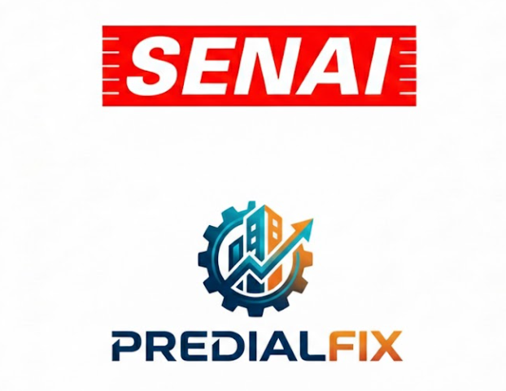

# PredialFix

<!-- Improved compatibility of back to top link: See: https://github.com/othneildrew/Best-README-Template/pull/73 -->

<!-- PROJECT LOGO -->
 

  

<h3 align="center">PredialFix</h3>

  

    O "PredialFix" será uma plataforma para gerenciar solicitações de manutenção predial no Senai. O sistema visa resolver problemas como a falta de transparência e a demora no atendimento de chamados, centralizando as solicitações e permitindo o acompanhamento de cada etapa até a resolução. O foco inicial é o desenvolvimento do Back-End, que fornecerá uma API RESTful para futuras integrações com interfaces de usuário (Front-End).
     

<!-- ABOUT THE PROJECT -->
## Sobre o Projeto

O "PredialFix" será uma plataforma para gerenciar solicitações de manutenção predial no Senai. O sistema visa resolver problemas como a falta de transparência e a demora no atendimento de chamados, centralizando as solicitações e permitindo o acompanhamento de cada etapa até a resolução. O foco inicial é o desenvolvimento do Back-End, que fornecerá uma API RESTful para futuras integrações com interfaces de usuário (Front-End).

(<a href="#readme-top">voltar para o topo</a>)

### Tecnologias Utilizadas

* **Back-End:** [![Laravel][Laravel.com]][Laravel-url] com [![MySQL][MySQL.com]][MySQL-url]
* **Front-End:** [![React][React.js]][React-url] com [![Tailwind CSS][Tailwind.com]][Tailwind-url]

(<a href="#readme-top">voltar para o topo</a>)

## Protótipo

Acesse o protótipo da interface no Figma: [Link para o Figma](https://www.figma.com/site/7rBeSDg6EBjocLUKzxxonh/PredialFix?node-id=0-1&t=87o2HwW8FBtxYwml-1)

(<a href="#readme-top">voltar para o topo</a>)

<!-- MARKDOWN LINKS & IMAGES -->
<!-- https://www.markdownguide.org/basic-syntax/#reference-style-links -->
[React.js]: https://img.shields.io/badge/React-20232A?style=for-the-badge&logo=react&logoColor=61DAFB
[React-url]: https://reactjs.org/
[Laravel.com]: https://img.shields.io/badge/Laravel-FF2D20?style=for-the-badge&logo=laravel&logoColor=white
[Laravel-url]: https://laravel.com
[MySQL.com]: https://img.shields.io/badge/MySQL-005C84?style=for-the-badge&logo=mysql&logoColor=white
[MySQL-url]: https://www.mysql.com/
[Tailwind.com]: https://img.shields.io/badge/Tailwind_CSS-38B2AC?style=for-the-badge&logo=tailwind-css&logoColor=white
[Tailwind-url]: https://tailwindcss.com/ 
