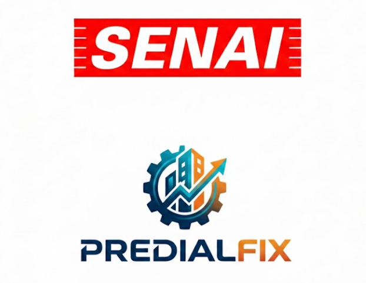
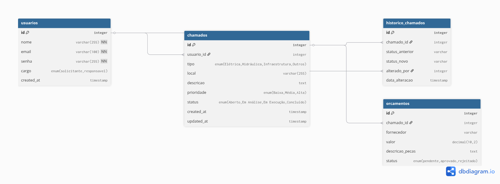

# PredialFix

 

  

<h3 align="center">PredialFix</h3>

  

    O "PredialFix" será uma plataforma para gerenciar solicitações de manutenção predial no Senai. O sistema visa resolver problemas como a falta de transparência e a demora no atendimento de chamados, centralizando as solicitações e permitindo o acompanhamento de cada etapa até a resolução. O foco inicial é o desenvolvimento do Back-End, que fornecerá uma API RESTful para futuras integrações com interfaces de usuário (Front-End).
     

## Sumário

- [Sobre o Projeto](#sobre-o-projeto)
- [Tecnologias Utilizadas](#tecnologias-utilizadas)
- [Protótipo](#protótipo)
  - [Interface de Usuário (Figma)](#1-interface-de-usuário-figma)
  - [Arquitetura de Dados (DER)](#2-arquitetura-de-dados-der)
  - [Mapa de Endpoints](#3-mapa-de-endpoints)

## Sobre o Projeto

O "PredialFix" será uma plataforma para gerenciar solicitações de manutenção predial no Senai. O sistema visa resolver problemas como a falta de transparência e a demora no atendimento de chamados, centralizando as solicitações e permitindo o acompanhamento de cada etapa até a resolução. O foco inicial é o desenvolvimento do Back-End, que fornecerá uma API RESTful para futuras integrações com interfaces de usuário (Front-End).

(<a href="#readme-top">voltar para o topo</a>)

### Tecnologias Utilizadas

* **Back-End:** [![Laravel][Laravel.com]][Laravel-url] com [![MySQL][MySQL.com]][MySQL-url]
* **Front-End:** [![Vue.js][Vue.js]][Vue-url] com [![Tailwind CSS][Tailwind.com]][Tailwind-url]

(<a href="#readme-top">voltar para o topo</a>)

## Protótipo

O desenvolvimento do PredialFix seguiu uma abordagem de prototipagem em três níveis: Interface (UX/UI), Dados (Banco de dados) e Comunicação (API).

### 1. Interface de Usuário (Figma)
 * [Acesse o protótipo no Figma](https://www.figma.com/site/7rBeSDg6EBjocLUKzxxonh/PredialFix?node-id=0-1&t=87o2HwW8FBtxYwml-1)
   
### 2. Arquitetura de Dados (DER)
 Planejado para garantir a **transparência total** exigida, o banco de dados conta com tabelas de histórico para auditoria de cada mudança de status e gestão de orçamentos.

 

## 3. Mapa de Endpoints 
 Abaixo estão as principais rotas planejadas:
 | Método | Rota | Descrição |
 | :--- | :--- | :---|
 | `POST` | `/api/login`| Autenticação e geração de Token de acesso |
 | `POST` | `/api/chamados`| Registro de nova solicitação |
 | `GET` | `/api/chamados` | Listagem geral com filtro de status |
 | `PATCH` | `/api/chamados/{id}/status` | Atualização do status do chamado |
 | `POST` | `/api/orcamentos` | Registro de custos para aprovação |
  

(<a href="#readme-top">voltar para o topo</a>)

[Vue.js]: https://img.shields.io/badge/Vue.js-35495E?style=for-the-badge&logo=vuedotjs&logoColor=4FC08D
[Vue-url]: https://vuejs.org/
[Laravel.com]: https://img.shields.io/badge/Laravel-FF2D20?style=for-the-badge&logo=laravel&logoColor=white
[Laravel-url]: https://laravel.com
[MySQL.com]: https://img.shields.io/badge/MySQL-005C84?style=for-the-badge&logo=mysql&logoColor=white
[MySQL-url]: https://www.mysql.com/
[Tailwind.com]: https://img.shields.io/badge/Tailwind_CSS-38B2AC?style=for-the-badge&logo=tailwind-css&logoColor=white
[Tailwind-url]: https://tailwindcss.com/
