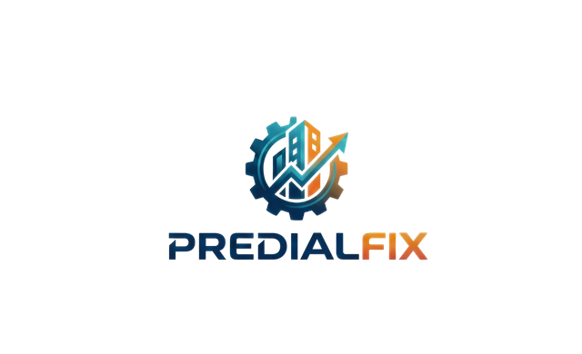

# PredialFix

 

  

<h3 align="center">PredialFix</h3>

  

    Plataforma para gerenciar solicitações de manutenção predial no Senai.
     

---

## 🔗 Links do Projeto

📌 [Figma](https://www.figma.com/site/7rBeSDg6EBjocLUKzxxonh/PredialFix?node-id=0-1&t=87o2HwW8FBtxYwml-1)

📌 [Trello](https://trello.com/b/LMRbT3a9/predialfix)

---

**Situação Problema**

O SENAI enfrenta desafios no gerenciamento de solicitações de manutenção predial. A ausência de um sistema estruturado gera falta de transparência, demora no atendimento dos chamados e dificuldade no controle das solicitações. 

Diante desse cenário, surge o **PredialFix**, uma plataforma para centralizar as solicitações e permitir o acompanhamento de cada etapa até a resolução. O projeto utiliza uma arquitetura híbrida:
- **Web**: Interface rica utilizando **Inertia.js** com **Vue.js** para uma experiência fluida no desktop.
- **Mobile**: Disponibilização de uma **API RESTful** robusta para integração com dispositivos móveis.

---

 **Objetivo do Projeto**

O objetivo principal do PredialFix é centralizar as demandas de manutenção predial. O projeto foca em:

- Desenvolver uma aplicação robusta, organizada e escalável para Web e Mobile
- Prover uma **API RESTful** segura para consumo de aplicativos móveis
- Gerenciar o fluxo de chamados para dar mais transparência
- Permitir o acompanhamento das etapas até a resolução do problema através de um painel administrativo
- Integrar tecnologias modernas para o gerenciamento dos dados e interface rica

---

 **Tecnologias Utilizadas**

* **Back-End:** [![Laravel][Laravel.com]][Laravel-url] [![SQLite][SQLite.com]][SQLite-url] [![Filament][Filament.com]][Filament-url]
* **Front-End:** [![Vue.js][Vue.js]][Vue-url] [![Inertia.js][Inertia.com]][Inertia-url] [![Tailwind CSS][Tailwind.com]][Tailwind-url] [![TypeScript][TypeScript.com]][TypeScript-url]

---

 **Levantamento de Requisitos**

O sistema foi estruturado para atender às necessidades de controle de chamados no SENAI, considerando aspectos como funcionalidade, desempenho e segurança:

- Cadastro e gerenciamento centralizado de chamados de manutenção.
- Interface administrativa completa via Filament PHP.
- Experiência Single Page Application (SPA) utilizando Inertia.js.
- Notificações em tempo real (em desenvolvimento).

---

 **Prototipagem**

O desenvolvimento do PredialFix seguiu uma abordagem de prototipagem em três níveis: Interface (UX/UI), Dados (Banco de dados) e Comunicação (API). A interface foi desenhada no Figma para alinhar expectativas e melhorar a usabilidade.

- **Acesse o protótipo no** [Figma](https://www.figma.com/site/7rBeSDg6EBjocLUKzxxonh/PredialFix?node-id=0-1&t=87o2HwW8FBtxYwml-1)

---

**Metodologias Ágeis**

Para garantir a eficiência no desenvolvimento e a organização das entregas, o projeto utiliza a metodologia Kanban. O fluxo de trabalho é dividido em três estados principais:
- **A Fazer**: Tarefas priorizadas e prontas para o início do desenvolvimento.
- **Em Andamento**: Funcionalidades que estão sendo codificadas e testadas.
- **Concluído**: Requisitos finalizados, documentados e com o merge realizado.

- **Acesse o quadro no** [Trello](https://trello.com/b/LMRbT3a9/predialfix)

[Vue.js]: https://img.shields.io/badge/Vue.js-35495E?style=for-the-badge&logo=vuedotjs&logoColor=4FC08D
[Vue-url]: https://vuejs.org/
[Laravel.com]: https://img.shields.io/badge/Laravel-FF2D20?style=for-the-badge&logo=laravel&logoColor=white
[Laravel-url]: https://laravel.com
[SQLite.com]: https://img.shields.io/badge/SQLite-07405E?style=for-the-badge&logo=sqlite&logoColor=white
[SQLite-url]: https://www.sqlite.org/
[Tailwind.com]: https://img.shields.io/badge/Tailwind_CSS-38B2AC?style=for-the-badge&logo=tailwind-css&logoColor=white
[Tailwind-url]: https://tailwindcss.com/
[Inertia.com]: https://img.shields.io/badge/Inertia.js-9553E9?style=for-the-badge&logo=inertia&logoColor=white
[Inertia-url]: https://inertiajs.com/
[TypeScript.com]: https://img.shields.io/badge/TypeScript-007ACC?style=for-the-badge&logo=typescript&logoColor=white
[TypeScript-url]: https://www.typescriptlang.org/
[Filament.com]: https://img.shields.io/badge/Filament-FFB200?style=for-the-badge&logo=filament&logoColor=black
[Filament-url]: https://filamentphp.com/